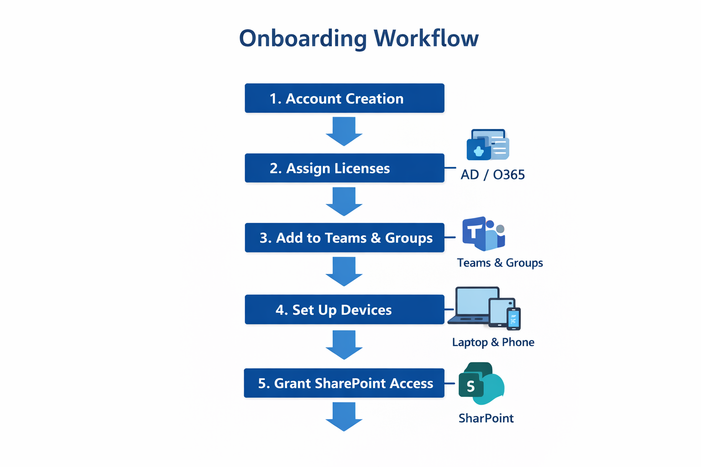

# M365 User Onboarding Automation

A PowerShell automation toolkit for managing Microsoft 365 user onboarding,
offboarding, and access control in remote-first and scaling organizations.

This repository demonstrates real-world IT operations practices focused on
security, consistency, and operational efficiency within the Microsoft ecosystem.

---

## Overview

Managing user onboarding manually in Microsoft 365 can be time-consuming and
error-prone, especially for distributed teams. This project provides a
structured, repeatable approach to handling the full user lifecycle using
PowerShell automation.

The scripts are designed to support IT Support Specialists and Service Desk
Engineers who manage Microsoft 365 environments for remote or fast-growing
organizations.

---

## Key Capabilities

- Automated Microsoft 365 user onboarding
- Secure user offboarding and account deactivation
- Microsoft 365 license assignment and removal
- Group and role-based access management
- Exchange mailbox configuration and permissions
- Centralized logging for audit and troubleshooting
- Dry-run mode for safe testing
- Menu-driven execution suitable for service desk use

---

## Architecture Overview

---

